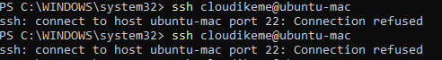
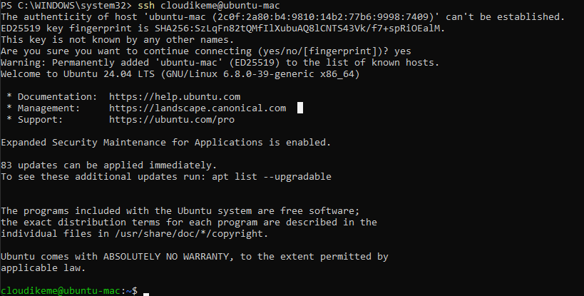

# Securely Accessing Your Linux Server from Windows using SSH Keys

Previously, I wrote about how I revived my old dead iMac with a fresh Ubuntu install and how I set up [barrierKVM](https://github.com/debauchee/barrier) for free to share one mouse and keyboard between them and copy from clipboard to clipboard. 

In this article, you will set up SSH key-based authentication for accessing your Linux server from a Windows client. This method enhances security by eliminating the need for password-based logins.

So, let’s get started!

**Prerequisites:**

- A Windows client machine with an SSH client. Windows 10 and 11 include OpenSSH client by default. You can access it through PowerShell or Command Prompt.
- A Linux server with OpenSSH server installed and running.

## Steps:

### 1. Generating an SSH Key Pair on Your Windows Client:

1. **Open PowerShell or Command Prompt as administrator.**

2. **Check for existing SSH keys:**

   ```powershell
   Get-ChildItem -Path $env:USERPROFILE\.ssh
   ```

   If files named `id_rsa` and `id_rsa.pub` exist, you already have a key pair.

3. **Generate a new key pair (if needed):**

   ```powershell
   ssh-keygen -t rsa -b 4096 -f $env:USERPROFILE\.ssh\id_rsa
   ```

   This creates a 4096-bit RSA key pair. You can customize the file path if desired.

4. **Secure your key (optional):**

   You'll be prompted to set a passphrase. This adds an extra layer of security.

5. **Your public key (`id_rsa.pub`) is now ready to be copied:**

   ```powershell
   Get-Content -Path $env:USERPROFILE\.ssh\id_rsa.pub | Set-Clipboard
   ```

   This copies the contents of the public key to your clipboard for easy pasting.

### 2. Configuring Your Linux Server:

1. **Open a terminal session on your Linux server and log in as the user you want to grant access to.**

2. **Navigate to the SSH directory (create it if it doesn't exist):**

   ```bash
   mkdir ~/.ssh
   cd ~/.ssh
   ```

3. **Create or edit the `authorized_keys` file:**

   ```bash
   nano authorized_keys
   ```

4. **Paste the contents of your Windows client's `id_rsa.pub` into this file. (You copied it to your clipboard in the previous step).**

5. **Save and close `authorized_keys` (Ctrl+X, Y, Enter in nano).**

6. **Set appropriate permissions (important!):**

   ```bash
   chmod 700 ~/.ssh
   chmod 600 ~/.ssh/authorized_keys
   ```

   This ensures only the owner can access the `.ssh` directory and its contents.

### 3. Connecting to Your Linux Server:

a. **From your Windows PowerShell or Command Prompt, run:**

   ```powershell
   ssh -i $env:USERPROFILE\.ssh\id_rsa username@linux_server_ip
   ```

   Replace `username` with your Linux username and `linux_server_ip` with the IP address or hostname of your server.


b. **If prompted, enter your SSH key passphrase.**

c. **You should now be logged into your Linux server!**

Finally, this is one little detail most people leave out: you might run into an error like the one below if you don’t purge OpenSSH server from your Linux server before trying to connect.

Before OpenSSH server purge:



Purge OpenSSH server and reinstall it before you try to connect.

```bash
sudo apt-get purge openssh-server
sudo apt-get install openssh-server
```

After purge and install:



**Troubleshooting:**

- Ensure OpenSSH Server is running on your Linux server (check with `sudo systemctl status ssh`).
- Verify firewall rules on the Linux server allow SSH connections (port 22). You might need to configure this if you have a firewall enabled.
- Double-check that the permissions on the `.ssh` directory and `authorized_keys` file are correct on the Linux server.
- If you are using a passphrase and get authentication errors, make sure you are entering it correctly.

**Additional Notes:**

- For added security, consider disabling password-based authentication on your Linux server after setting up SSH keys. This can usually be done by modifying the SSH server configuration file (`/etc/ssh/sshd_config`).
- You can use this same process to connect to different user accounts on the Linux server by specifying the correct username in the `ssh` command.
- This guide focuses on using the default SSH port (22). If your server uses a different port, specify it using the `-p` flag with the `ssh` command.

By following these steps, you've successfully configured secure, key-based SSH access to your Linux server from your Windows client, improving the security of your remote administration tasks.